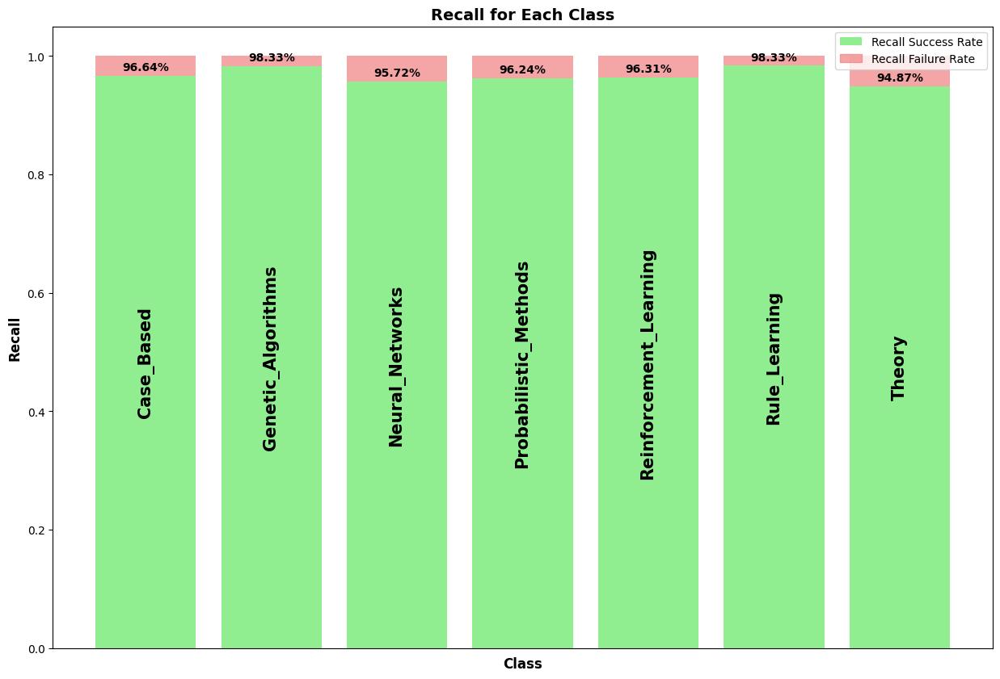

# CORA Dataset Node Classification

In this project I developed a Node Classifier for the CORA dataset consisting of 2708 scientific publications. To prepare the graph data from the `./cora/cora.cites` & `./cora/cora.content` files I have utilized the [StellarGraph](https://stellargraph.readthedocs.io/en/stable/README.html) library. The overall process to prepare the data & train the classifier are expande upon under [Process Overview](#process-overview). 
*  *  *
## Tasks Completed
The following tasks have been completed over the couse of this project.  
- [x] Load the data.
- [x] Split the data using 10-fold cross validation.
- [x] Develop a Machine Learning approach to learn and predict the subjects of papers.
- [x] Store predictions in a [TSV file](./inference_predictions.tsv).
- [x] Evaluate approach in terms of **accuracy**.
*  *  *

## Results



The `final_model` is [trained](./train.py) using a 10-fold cross validation scheme for 200 Epochs, where each fold is visited every $10^{th}$ Epoch. The relevant performance metrics are illustrated in the table below.

| Metric  | Percentage | 
|-------|-----| 
| Accuracy on the Validation Set   | 88.48%  | 
| Accuracy on the Entire Cora Dataset  | 96.52%  |
| Recall on the Entire Cora Dataset | 96.63%  | 

The validation set accuracy is captured during [training](./train.py), while the accuracy and recall on the entire dataset are determined in [`check.py`](./check.py).


*  *  *
## System Requirements

* Ubuntu 20.04.5 LTS
* Conda == 22.11.1 ([Installion Link](https://anaconda.org/anaconda/conda/files?version=22.11.1&page=1)) **or** Mamba == 1.2.0 ([Installtion Link](https://github.com/mamba-org/mamba/releases/tag/2023.01.16)).

*  *  *
## Set Up & Model Verification

* To evaluate the performance of the`final_model` using the `check.py` script first the required conda/mamba virtual environment should be created and activated.
* To create the virtual environment execute the below command.
```
    (base) conda env create -f environment.yaml
```
* Once the `stellar_env` is created it can be activated as follows:
```
    (base) source activate stellar_env
```
* To evaluate the `final_model` models' performance execute the following command after activating the virtual environment.
```
    (stellar_env) python check.py
```
* To deactivate the virtual environment execute the following command.
```
    (stellar_env) conda deactivate
```

*  *  *

## Process-Overview

The steps outlined below originate from the [`train.py`](./train.py) script.

### Loading the data

*  The `./cora/cora.content/` and `./cora/cora.cites` files contain information pertaining to the node features and node-to-node mappings of the Cora Dataset respectively. These TSV files can be loaded using Pandas Dataframes.
*  After resetting the index and dropping the `subject` column the `cora_content_no_subject` dataframe obtained from `./cora/cora.content` TSV file is in a format to the StellarGraph instance.
*  Passing `cora_content_no_subject` and `cora_cites` to the StellarGraph instance allows us to create the required graph data `cora_no_subject`. The resultant graph structure has the following properties:

    ```
        StellarGraph: Undirected multigraph
        Nodes: 2708, Edges: 5429

        Node types:
        paper: [2708]
            Features: float32 vector, length 1433
            Edge types: paper-cites->paper

        Edge types:
            paper-cites->paper: [5429]
                Weights: all 1 (default)
    ```

### Preparing targets
*  The string labels are mapped to one-hot vectors to enable a Softmax output. To perform this conversion the `LabelBinarizer` from `scikit-learn` is used. The labels `cora_targets` is a numpy.ndarray of the shape (2708, 7).  
    ```
        array([[0, 0, 1, ..., 0, 0, 0],
               [0, 0, 0, ..., 0, 1, 0],
               [0, 0, 0, ..., 1, 0, 0],
                         ...,
               [0, 1, 0, ..., 0, 0, 0],
               [1, 0, 0, ..., 0, 0, 0],
               [0, 0, 1, ..., 0, 0, 0]])
    ``` 
### Model configuration